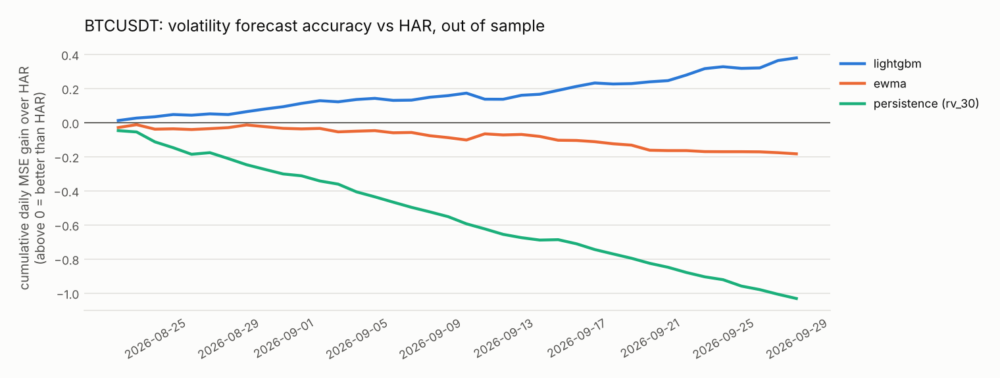
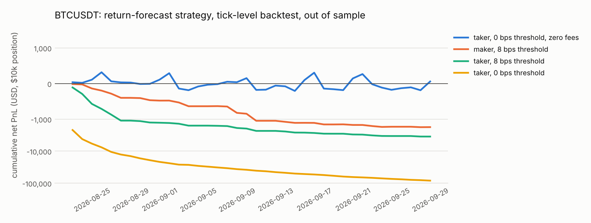

# tickforge

A tick-level research framework for crypto markets: leakage-safe features, purged walk-forward validation, and a backtest engine written in Rust that replays every trade.

The project is built around one question: **when a machine-learning model appears to predict a market, how much of that survives honest evaluation and realistic execution?** On two months of Binance futures ticks (140.6 million trades), the answer is:

- **Volatility is predictable, and ML helps.** LightGBM beats the standard HAR model out of sample by 8.3% (BTC) and 6.8% (ETH) in squared error, and wins on 79% and 87% of test days.
- **Short-horizon returns are not, at least not with these features.** No model beats a forecast of zero, and the most flexible model is the worst. Trading the forecast loses almost exactly what it pays in fees.

Both results are reported in full below, including the ones that make the model look bad.

## Why crypto

The framework is market-agnostic, but the data is crypto for a practical reason: **crypto is the only major asset class where tick-level data is free.** Trade-by-trade history for equities and commodity futures is sold by exchanges and vendors, and the free sources for those markets stop at daily or minute bars. Binance publishes every trade since listing, with aggressor side, at [data.binance.vision](https://data.binance.vision), and its live order book feed needs no account.

"Free" has limits, and they shape the design:

| Data | Free? | How tickforge uses it |
|---|---|---|
| Every trade, with aggressor side (`aggTrades`) | Yes, full history | Bars, order-flow features, backtest tape |
| Depth within ±0.2% to ±5% of mid, every ~30 s (`bookDepth`, futures) | Yes | Book-imbalance and liquidity features |
| Historical best bid/ask quotes | No | Reconstructed from the tape (see [execution model](#execution-model)) |
| Historical full order book (L2) | No | Recorded live with `tickforge record` |

## Results

Setup, fixed before the first run and not tuned afterwards: BTCUSDT and ETHUSDT perpetual futures, 1 August to 30 September 2026, one-minute bars. Each test day is forecast by models trained on the preceding 21 days, with training samples purged by the label horizon. That gives 38 test days and 54,720 out-of-sample bars per symbol. Full tables are in [`results/`](results/).

### Volatility: 30-minute realised volatility

| Model | BTC MSE | BTC QLIKE | BTC R² vs HAR | ETH MSE | ETH QLIKE | ETH R² vs HAR |
|---|---:|---:|---:|---:|---:|---:|
| Persistence (last 30 min) | 0.1478 | 0.405 | −22.5% | 0.1668 | 0.507 | −25.9% |
| EWMA | 0.1255 | 0.316 | −4.0% | 0.1431 | 0.398 | −8.1% |
| HAR (Corsi, 2009) | 0.1206 | 0.343 | 0 | 0.1324 | 0.425 | 0 |
| **LightGBM** | **0.1107** | **0.287** | **+8.3%** | **0.1234** | **0.353** | **+6.8%** |

MSE is on log volatility; lower is better for MSE and QLIKE. LightGBM's daily loss is lower than HAR's on 30 of 38 days for BTC (paired t = 4.3) and 33 of 38 for ETH (t = 2.9).



### Returns: 5-minute forward return

| Model | BTC rank IC | BTC R² vs zero | ETH rank IC | ETH R² vs zero |
|---|---:|---:|---:|---:|
| Zero (random walk) | 0 | 0 | 0 | 0 |
| Momentum | 0.025 | −0.10% | 0.010 | −0.15% |
| Order-flow imbalance | 0.005 | −0.07% | 0.009 | −0.05% |
| Ridge | 0.017 | −0.94% | 0.004 | −1.38% |
| LightGBM | 0.012 | −4.49% | 0.010 | −4.45% |

Every model has a slightly positive rank correlation with future returns and a *negative* R²: the forecasts point the right way marginally more often than not, but their magnitudes are noise. More model capacity makes this worse, not better.

### Trading the return forecast

The LightGBM forecast is traded on the tick tape with a $10,000 position: long or short when the forecast exceeds a threshold, flat otherwise, flat at each day's end.

| Strategy (BTC) | Net PnL | Fees paid | Turnover | PnL per $ traded |
|---|---:|---:|---:|---:|
| Taker, no threshold, **zero fees** | +$58 | $0 | $166M | 0.00 bps |
| Taker, no threshold | −$83,098 | $83,156 | $166M | −5.0 bps |
| Taker, 8 bps threshold | −$3,499 | $3,454 | $6.9M | −5.1 bps |
| Maker, no threshold | −$37,957 | $23,910 | $120M | −3.2 bps |
| Maker, 8 bps threshold | −$1,775 | $1,259 | $6.3M | −2.8 bps |

With zero fees the strategy makes nothing (t = 0.05). With fees it loses the 5 bps taker fee on every dollar traded, at every threshold. Posting passively cuts the fee to 2 bps but the loss per dollar is about 3 bps: the remaining basis point is consistent with adverse selection, since a resting order fills when the market moves through it. ETH shows the same pattern. Across the eight fee-paying configurations per symbol the deflated Sharpe ratio is zero to many decimal places.



## How the evaluation is kept honest

**No lookahead in features.** Every feature at time *t* is computed from data stamped before *t*. Bars carry the timestamp at which they became fully known, and data on another clock (depth snapshots) is joined strictly backward. `tests/test_leakage.py` checks this mechanically: features are recomputed on a truncated or corrupted future and must not change.

**Purged validation.** A 30-minute label overlaps the 29 labels after it, so adjacent samples share information. `PurgedKFold` and `WalkForward` drop training samples whose label window touches the test block ([López de Prado, 2018](https://www.wiley.com/en-us/Advances+in+Financial+Machine+Learning-p-9781119482086)), and the experiment asserts no overlap on every fold.

**Baselines through the same code path.** The zero forecast, momentum, EWMA and HAR implement the same interface as LightGBM and are scored by the same functions.

**Multiple-testing correction.** Backtests report the deflated Sharpe ratio ([Bailey & López de Prado, 2014](https://papers.ssrn.com/sol3/papers.cfm?abstract_id=2460551)), which discounts the best result by the number of configurations tried. A test shows the naive statistic being fooled by the best of 200 random strategies while the deflated one is not.

**A planted-leak test.** Handing the model its own label sends the rank IC to above 0.9, which confirms that the near-zero IC on real features is a finding and not a broken pipeline.

## Execution model

The backtest engine (`rust/src/engine.rs`) replays the trade tape and is deliberately pessimistic:

- Quotes are reconstructed from trades: a seller-initiated print marks the bid, a buyer-initiated print marks the ask.
- Orders reach the market 50 ms after the decision.
- Taker orders cross the reconstructed spread and pay the taker fee (5 bps, Binance's base tier).
- Maker orders rest at the touch and fill only when a later trade prints strictly *through* their price, which treats the order as last in the queue. Unfilled orders are cancelled at the next decision.

## Architecture

```
rust/src/
  bars.rs       trades -> time / tick / volume / dollar bars with signed order flow
  book.rs       L2 order book on integer ticks: microprice, imbalance, sweep cost
  engine.rs     tick-level backtest: latency, fees, taker and maker fills
  lib.rs        PyO3 bindings (tickforge._core)
python/tickforge/
  data/         Binance archive client (checksum-verified), Parquet store, DuckDB queries
  features.py   point-in-time features: volatility, order flow, liquidity, depth, cross-asset
  labels.py     forward returns and realised volatility
  validation.py purged K-fold and walk-forward splitters
  models.py     baselines, HAR, ridge, LightGBM behind one interface
  metrics.py    IC, out-of-sample R², QLIKE, probabilistic and deflated Sharpe
  backtest.py   Python wrapper around the Rust engine
  experiment.py end-to-end walk-forward pipeline
  live/         live order book recorder with snapshot/diff synchronisation
```

Rust handles everything that touches individual ticks. On one day of BTCUSDT (1.32 million trades), on a 2-core machine, bar building takes 9.6 ms and a full backtest 7.9 ms, so the nine backtest configurations over 38 days run in about five seconds.

## Usage

Requires Python 3.10+ and a Rust toolchain.

```bash
pip install -e ".[dev,live]" matplotlib

# Offline tour on synthetic ticks
python examples/quickstart.py

# Reproduce the results above (the Parquet store takes about 800 MB)
tickforge ingest --start 2026-08-01 --end 2026-09-30
tickforge run --symbol BTCUSDT --cross-symbol ETHUSDT --start 2026-08-01 --end 2026-09-30
tickforge run --symbol ETHUSDT --cross-symbol BTCUSDT --start 2026-08-01 --end 2026-09-30

# Record the live spot order book for a minute
tickforge record --symbol BTCUSDT --seconds 60
```

Or with Docker: `docker build -t tickforge . && docker run -v $PWD/data:/work/data tickforge ingest --start 2026-08-01 --end 2026-09-30`.

Tests: `cargo test --no-default-features` (18 Rust tests) and `pytest` (41 Python tests).

## Limitations

- **Two months, one regime.** 38 test days is enough to separate LightGBM from HAR on volatility, but says little about how either behaves in a different market regime.
- **Reconstructed quotes.** The bid and ask are inferred from trades, so the spread is approximate between prints. On these contracts the spread is typically one tick (about 0.01 bps for BTC), so the effect on results is small, but it would matter on less liquid symbols.
- **No market impact.** Orders are assumed small relative to displayed size. That holds for $10,000 in BTCUSDT and would not for large orders.
- **No queue position model.** The maker fill rule is conservative rather than accurate; real fills depend on queue position, which needs full order book history.
- **Funding payments are ignored.** Positions are intraday and flat at day end, so the effect is small, but not zero.
- **The volatility result is statistical, not a strategy.** A better volatility forecast is useful for sizing, risk and options pricing; this project does not show that it can be monetised.

## Roadmap

- Order-book features from recorded L2 data, and a queue-position fill model built on them
- Sequence models (temporal convolution, transformer) on the volatility task, against the LightGBM result
- Volatility-targeted position sizing using the forecast, evaluated in the same backtest
- Longer history and regime-conditional evaluation

## License

MIT. Nothing here is investment advice.
